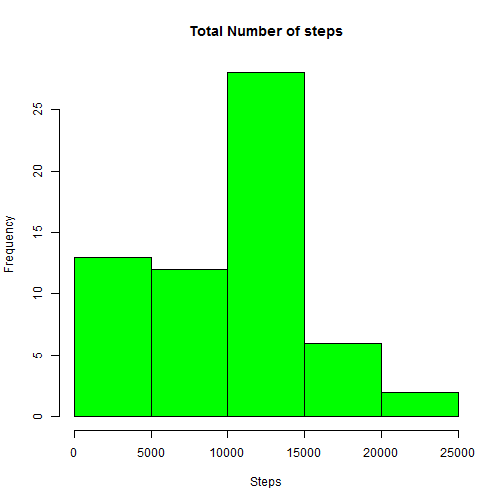
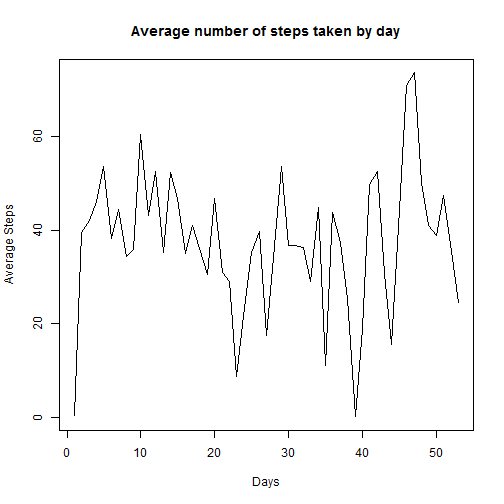
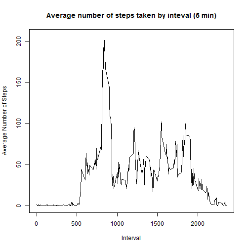
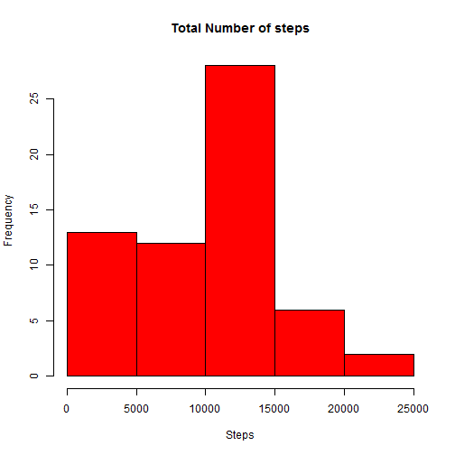
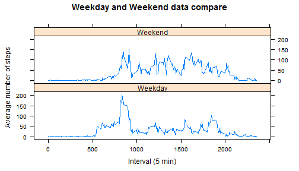

# Reproducible Research - Week 2 - Assignment

### 1. Code for reading the CSV into data set

```r
ds <- read.csv("activity.csv")
```

### 2. Histogram of the total number of steps

```r
total_steps <- tapply(ds$steps, ds$date, FUN=sum, na.rm=TRUE)
hist(total_steps, xlab = "Steps", col="green", main = "Total Number of steps")
```



### 3. Mean and Median number of steps taken each day

```r
mean_steps      <- mean(total_steps,   na.rm = TRUE)
median_steps    <- median(total_steps, na.rm = TRUE)
```

### 4. Time series plot of the average number of steps taken

```r
# Calculate average number of steps by day
average_steps <- tapply(ds$steps, ds$date, FUN=mean, na.rm=TRUE)

# Remove Nan from the array for time series.
average_steps <- average_steps[!is.nan(average_steps)]
plot(
    average_steps, 
    type="l", 
    xlab="Days", 
    ylab="Average Steps", 
    main="Average number of steps taken by day"
)
```


### 5. The 5-minute interval that, on average, contains the maximum number of steps

```r
average_data <- aggregate(steps ~ interval, data=ds, FUN=mean, na.rm=TRUE)
plot(
    x=average_data$interval, 
    y=average_data$steps, 
    type="l", 
    xlab="Interval", 
    ylab="Average Number of Steps", 
    main="Average number of steps taken by inteval (5 min)"
)
```



### 6. Code to describe and show a strategy for imputing missing data

```r
# Total number of missing values in the activity data set
missing_total <- sum(is.na(ds$steps))

# Replace all the missing values with 0
ds$steps[is.na(ds$steps)] <- 0
```

### 7.Histogram of the total number of steps taken each day after missing values are imputed

```r
total_steps <- tapply(ds$steps, ds$date, FUN=sum)
hist(total_steps, xlab = "Steps", col="red", main = "Total Number of steps")
```



### 8. Panel plot comparing the average number of steps taken per 5-minute interval across weekdays and weekends

```r
# Upload timeDate library to determine weekeday or weekend
library(timeDate)
library(lattice)

# convert the column into date class
ds$date <- as.Date(ds$date)

# Add new column to determine weekend or weekday
ds$dayType <- ifelse(isWeekend(ds$date), "Weekend", "Weekday")

# build aggregation based on new column
agg <- aggregate( steps ~ interval + dayType, data=ds, FUN = mean, rm.na = TRUE)
```


```r
# Plot
xyplot(
        steps ~ interval | dayType,
        data=agg,
        type = "l",
        layout = c(1,2),
        main = "Weekday and Weekend data compare",
        xlab = "Interval (5 min)",
        ylab = "Average number of steps"
)
```



